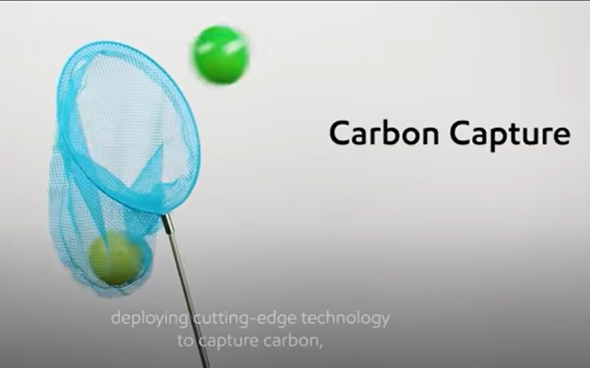

# doomsday
Collection of stories about climate change, dates in format dd-mm-yyyy, order is reverse chronological

 [28-07-2021]
* [Climate tipping points are now imminent, scientists warn](https://www.dw.com/en/climate-tipping-points-are-now-imminent-scientists-warn/a-58665256)

 [26-07-2021]
* [Evacuations ordered after two California wildfires converge into one](https://www.reuters.com/world/us/threat-lightning-storms-add-struggle-contain-large-california-fire-2021-07-25/)
* [Thunderstorms cause flash flooding in London, submerging roads and some train stations](https://edition.cnn.com/2021/07/25/weather/uk-london-floods-transport/index.html)

 [24-07-2021]
* [G20 ministers fail to agree tougher climate goals](https://www.dw.com/en/g20-ministers-fail-to-agree-tougher-climate-goals/a-58620631)

 [22-07-2021]
* [Deadly flooding paralyzes Henan province in China](https://www.youtube.com/watch?v=O0qd5UTDa-Q)
* [China flood terror as train carriage submerged](https://www.bbc.com/news/world-asia-china-57920412)
* [China Deadly flooding in Henan](https://www.dw.com/en/china-deadly-flooding-in-henan-in-pictures/g-58584188)
* [A new wave of "tropical heat" comes to Serbia](https://www.b92.net/eng/news/society.php?yyyy=2021&mm=07&dd=22&nav_id=111326)

 [21-07-2021]
* [The Amazon Now Emits More Carbon Than it Absorbs](https://time.com/6082313/amazon-carbon-tipping-point/)
* [Nature paper reports South-east Amazon is a carbon source](https://www.nature.com/articles/s41586-021-03629-6)

 [19-07-2021]
* [Raging Wildfires Sweep Across Siberia, Shrouding Region In Smoke](https://www.rferl.org/a/russia-wildfires-siberia/31365949.html)

 [16-07-2-21]
* [Germany floods: At least 93 dead and hundreds unaccounted for](https://www.bbc.com/news/world-europe-57858829)

 [15-07-2021]
* [Flooding in western parts of Germany](https://www.youtube.com/watch?v=H66dq54R9qQ)
* [Several cities in west of Germany flooded](https://www.reddit.com/r/europe/comments/okpxsc/atleast_20_dead_in_flash_floods_in_germany/)
* [Flooding in Belgium](https://www.vrt.be/vrtnws/nl/2021/07/15/liveblog-wateroverlast-donderdag/)
* [Verviers, Belgium flooding footage](https://www.reddit.com/r/europe/comments/okp2ia/apocalypse_in_verviers_this_morning/)
* [The Fossil Fuel Industry Wants You to Think It’s Solving Climate Change](https://www.youtube.com/watch?v=dVHx0_6tNDM)

 [11-07-2021]
* [Wildfires-rage-in-russia-spain-and-the-us-amid-high-temperatures](https://www.euronews.com/video/2021/07/10/wildfires-rage-in-russia-spain-and-the-us-amid-high-temperatures)
* [Fires after California heat wave](https://www.youtube.com/watch?v=jPDahkCBP9s)

 [09-07-2021]
* [NEW YORK SUBMERGED: New Yorkers vent their fury as subways flood](https://www.youtube.com/watch?v=bi8FEItN6lY)
* [Will climate change threaten supply of natural rubber](https://www.youtube.com/watch?v=p_9XvHBb3nw)

 [08-07-2021]
* [NASA's AIRS Tracks Record-Breaking Heat Wave in Pacific Northwest](https://climate.nasa.gov/news/3095/nasas-airs-tracks-record-breaking-heat-wave-in-pacific-northwest/)

 [06-07-2021]
* [Technology costs for energy transition may decline faster than anyone anticipates](https://www.pnas.org/content/118/27/e1917165118)
